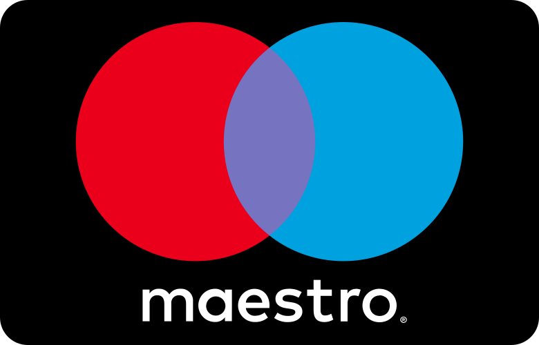
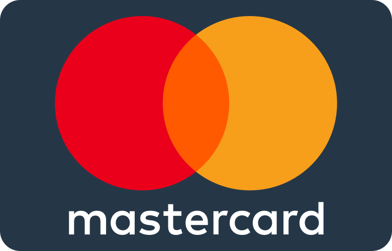
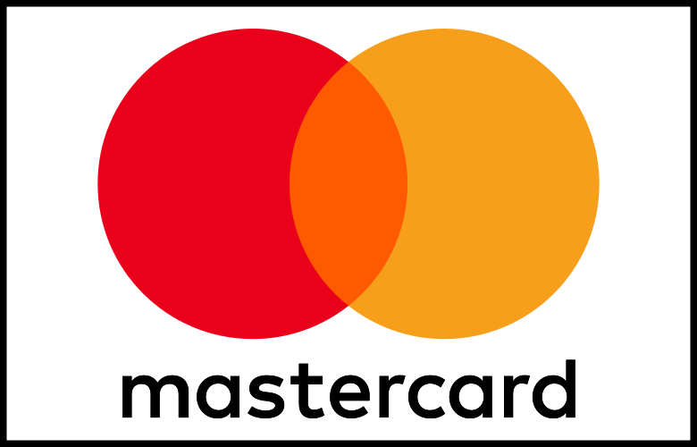

# React SVG Card Payment Icons

[](https://www.npmjs.com/package/react-svg-credit-card-payment-icons)
[](http://www.typescriptlang.org/)
[](https://www.npmjs.com/package/react-svg-credit-card-payment-icons)
[](http://makeapullrequest.com)
[](https://github.com/marcovoliveira/react-svg-credit-card-payment-icons)
[](https://github.com/marcovoliveira/react-svg-credit-card-payment-icons)
[](https://www.buymeacoffee.com/marcovoliveira)

SVG Credit Card & Payment Icons: 6 Styles, 80 Icons for React ⚛️

A collection of SVG based credit card logo icons.
React componnent with Typescript support.

## [Live Demo](https://marcovoliveira.github.io/react-svg-credit-card-payment-icons/?path=/docs/payment-cards--docs)

## 💿 Installation

1. Install this package:

```bash
npm install react-svg-credit-card-payment-icons
```

or

```bash
yarn add react-svg-credit-card-payment-icons
```

or

```bash
pnpm add react-svg-credit-card-payment-icons
```

## 📦 Usage

### Option 1: PaymentIcon Component

```tsx
import { PaymentIcon } from 'react-svg-credit-card-payment-icons';

const App = () => {
  return <PaymentIcon type="visa" format="flatRounded" width={100} />;
};
```

**Note:** The `PaymentIcon` component bundles all 108 icons (~700KB). For better tree-shaking and smaller bundle sizes, use Option 2.

### Option 2: Direct Icon Imports (Recommended for Bundle Size)

Import only the icons you need for optimal tree-shaking:

```tsx
import {
  Visa as VisaIcon,
  Mastercard as MastercardIcon,
} from 'react-svg-credit-card-payment-icons/icons/flat-rounded';

const App = () => {
  return (
    <>
      <VisaIcon width={100} />
      <MastercardIcon width={100} />
    </>
  );
};
```

Available import paths:

- `react-svg-credit-card-payment-icons/icons/flat`
- `react-svg-credit-card-payment-icons/icons/flat-rounded`
- `react-svg-credit-card-payment-icons/icons/logo`
- `react-svg-credit-card-payment-icons/icons/logo-border`
- `react-svg-credit-card-payment-icons/icons/mono`
- `react-svg-credit-card-payment-icons/icons/mono-outline`

## 🔧 Card Utilities

As of version 4, the package includes powerful card detection and validation utilities:

```tsx
import {
  detectCardType,
  validateCardNumber,
  formatCardNumber,
  maskCardNumber,
  isCardNumberPotentiallyValid,
} from 'react-svg-credit-card-payment-icons';

// Detect card type from number
const cardType = detectCardType('4242424242424242'); // Returns 'Visa'

// Validate card number using Luhn algorithm
const isValid = validateCardNumber('4242424242424242'); // Returns true

// Format card number with appropriate spacing
const formatted = formatCardNumber('4242424242424242'); // Returns '4242 4242 4242 4242'

// Mask card number (shows only last 4 digits)
const masked = maskCardNumber('4242424242424242'); // Returns '**** **** **** 4242'

// Check if card number is potentially valid (correct length, etc.)
const isPotentiallyValid = isCardNumberPotentiallyValid('4242424242424242'); // Returns true
```

### Available Utility Functions

| Function                                   | Description                       | Example                                                |
| ------------------------------------------ | --------------------------------- | ------------------------------------------------------ |
| `detectCardType(cardNumber)`               | Detects card type from number     | `detectCardType('4242...') // 'Visa'`                  |
| `validateCardNumber(cardNumber)`           | Validates using Luhn algorithm    | `validateCardNumber('4242...') // true`                |
| `formatCardNumber(cardNumber)`             | Formats with appropriate spacing  | `formatCardNumber('4242...') // '4242 4242 4242 4242'` |
| `maskCardNumber(cardNumber)`               | Masks all but last 4 digits       | `maskCardNumber('4242...') // '**** **** **** 4242'`   |
| `isCardNumberPotentiallyValid(cardNumber)` | Checks if potentially valid       | `isCardNumberPotentiallyValid('4242') // false`        |
| `validateCardForType(cardNumber, type)`    | Validates for specific card type  | `validateCardForType('4242...', 'Visa') // true`       |
| `getCardLengthRange(cardType)`             | Gets min/max length for card type | `getCardLengthRange('Visa') // {min: 13, max: 19}`     |
| `sanitizeCardNumber(cardNumber)`           | Removes non-digit characters      | `sanitizeCardNumber('4242-4242') // '42424242'`        |

### Complete Example with Card Input

```tsx
import React, { useState } from 'react';
import {
  PaymentIcon,
  detectCardType,
  validateCardNumber,
  formatCardNumber,
} from 'react-svg-credit-card-payment-icons';

function CardInput() {
  const [cardNumber, setCardNumber] = useState('');
  const cardType = detectCardType(cardNumber);
  const isValid = validateCardNumber(cardNumber);

  return (
    <div>
      <input
        type="text"
        value={cardNumber}
        onChange={(e) => setCardNumber(e.target.value)}
        placeholder="Enter card number"
      />
      <PaymentIcon type={cardType} width={40} />
      <div>Type: {cardType}</div>
      <div>Valid: {isValid ? 'Yes' : 'No'}</div>
      <div>Formatted: {formatCardNumber(cardNumber)}</div>
    </div>
  );
}
```

### Tree-Shakeable Example

For better bundle optimization, import only the cards you need:

```tsx
import { Visa, Mastercard } from 'react-svg-credit-card-payment-icons/icons/flat-rounded';
import { detectCardType } from 'react-svg-credit-card-payment-icons';

function PaymentForm() {
  const cardType = detectCardType(cardNumber);

  return (
    <div>
      {cardType === 'Visa' && <Visa width={40} />}
      {cardType === 'Mastercard' && <Mastercard width={40} />}
    </div>
  );
}
```

## [Types and Formats](https://marcovoliveira.github.io/react-svg-credit-card-payment-icons/?path=/story/test-your-card--default&args=type:Generic)

### Available `types` and their images

If the type does not exist, the default setting is generic.

| Type         | Image                                                                                           |
| ------------ | ----------------------------------------------------------------------------------------------- |
| `alipay`     |                  |
| `amex`       |  |
| `diners`     |                  |
| `discover`   |            |
| `elo`        |                           |
| `hiper`      |                     |
| `hipercard`  |         |
| `jcb`        |                           |
| `maestro`    |               |
| `mastercard` |      |
| `mir`        |                           |
| `paypal`     |                  |
| `swish`      |                     |
| `unionpay`   |            |
| `visa`       |                        |
| `generic`    |               |
| `code`       |                        |
| `codefront`  |      |

Images from [`aaronfagan/svg-credit-card-payment-icons`](https://github.com/aaronfagan/svg-credit-card-payment-icons)

### Available `formats`

If the format is not specified, the default setting is flat.

| Format        | Image                                                                                                    |
| ------------- | -------------------------------------------------------------------------------------------------------- |
| `flat`        |                  |
| `flatRounded` |  |
| `logo`        |                  |
| `logoBorder`  |    |
| `mono`        |                  |
| `monoOutline` |  |

- Specify either width or height; there's no requirement to define both. The aspect ratio is preset at 780:500 for SVGs. If neither width nor height is defined, width will default to 40.

- The component also allows all the properties (props) of the Svg component, including attributes like style.

- If an invalid type is provided, the default setting is generic.

## Contributing

Contributions are welcome! Please open an issue or submit a pull request on GitHub.

### Development Setup

This project uses [pnpm](https://pnpm.io/) as its package manager for local development and CI/CD.

```bash
# Install pnpm if you don't have it
npm install -g pnpm

# Install dependencies
pnpm install

# Run linting
pnpm run lint

# Build the project
pnpm run build
```
